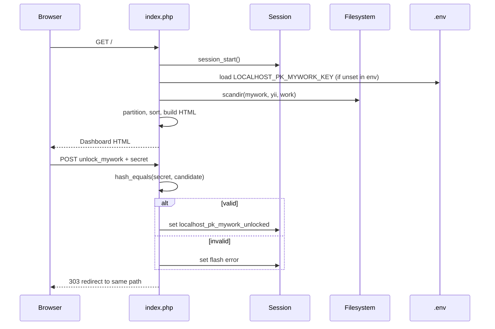

# localhost.pk — Project Architecture

**HR-7 Phase A pilot · Architecture review**  
**Scope:** LOCAL mode · repository root only  
**Last reviewed:** 2026-06-14

## Executive summary

`localhost.pk` is a **single-file PHP dashboard** that serves as the landing page for a Docker-hosted local development environment. It auto-discovers project folders on the filesystem, groups them into navigable buckets, and exposes fixed shortcuts to shared infrastructure tools. There is no database, no application framework, and no build step — the entire application lives in `index.php` with a companion `phpinfo.php` diagnostic page.

| Attribute | Value |
|-----------|-------|
| **Runtime** | PHP 8.3 (Apache, proxied via nginx) |
| **URL** | `https://localhost.pk` |
| **Pattern** | Monolithic server-rendered PHP |
| **State** | PHP sessions only (My Work unlock gate) |
| **Data source** | Filesystem directory scan |
| **Frontend** | Bootstrap 5.3 + Bootstrap Icons (CDN), inline CSS/JS |

## System context

The dashboard sits inside a multi-site Docker stack where each project folder maps to a `{folder-name}.pk` HTTPS virtual host.

```text
                    ┌─────────────────┐
                    │  nginx (TLS)    │
                    │  *.pk domains   │
                    └────────┬────────┘
                             │
                    ┌────────▼────────┐
                    │ Apache + PHP    │
                    │ 8.3             │
                    └────────┬────────┘
                             │
         ┌───────────────────┼───────────────────┐
         │                   │                   │
  ┌──────▼──────┐    ┌───────▼───────┐   ┌──────▼──────┐
  │ localhost.pk│    │ project.pk    │   │ sitemanager │
  │ (dashboard) │    │ (each folder) │   │ .pk         │
  └─────────────┘    └───────────────┘   └─────────────┘
```

### Filesystem layout (discovery roots)

Project discovery is driven by the location of this repo on disk. From `index.php`:

```php
$projectsRoot = dirname(dirname(__DIR__));  // e.g. /var/www/html
$myworkPath   = dirname(__DIR__);            // e.g. /var/www/html/mywork
$yiiPath      = $projectsRoot . '/yii';
$workPath     = $projectsRoot . '/work';
```

On the current host this resolves to:

```text
/var/www/html/                    ← projects root
├── mywork/                       ← personal projects (gated)
│   └── localhost.pk/             ← this dashboard
├── yii/                          ← Yii projects (shown under My Work when unlocked)
└── work/                         ← work projects (always visible)
```

Each discovered subfolder name becomes a link: `https://{folder-name}/`.

## Repository structure

```text
localhost.pk/
├── index.php          # Application: logic + UI (single file)
├── readme.php         # README.md preview (standalone + embed for lightbox)
├── phpinfo.php        # PHP environment diagnostic
├── .env               # Optional LOCALHOST_PK_MYWORK_KEY (not committed)
├── README.md          # User-facing setup and customization guide
└── docs/
    ├── ARCHITECTURE.md
    ├── QA-REVIEW-LCLDCR-T00001.md
    ├── AGENT-PILOT-MARKER.md
    └── TEST-E-MARKER.md
```

There are no Composer dependencies, no `package.json`, no Docker files, and no CI configuration within this repository. Deployment and reverse-proxy configuration live outside the repo.

## Request lifecycle



### Phase 1 — Bootstrap and configuration

1. **Session** — `session_start()` if not already active.
2. **Secret loading** — reads `LOCALHOST_PK_MYWORK_KEY` from the process environment; if absent, parses `.env` in the repo root (comments and quoted values supported).
3. **Fallback secret** — defaults to `local-dev` when neither source provides a value (local development only).

### Phase 2 — POST handlers (gate)

Two form actions, both using **303 redirect** back to the current path (POST-redirect-GET):

| Action | POST field | Effect |
|--------|------------|--------|
| Unlock | `unlock_mywork` + `mywork_secret` | Compares secret with `hash_equals()`; sets `$_SESSION['localhost_pk_mywork_unlocked']` on success |
| Lock | `lock_mywork` | Clears unlock session keys |

Flash errors are stored in `$_SESSION['localhost_pk_unlock_flash']`, consumed once on the next GET, and the unlock modal auto-opens when a flash is present.

### Phase 3 — Project discovery

`$listProjects($basePath)`:

- Returns `[]` if the path is missing or unreadable.
- Scans with `scandir()`, keeps only directories not in `$excludeDirs`.
- Sorts case-insensitively (`SORT_STRING | SORT_FLAG_CASE`).

Categories collected:

| Key | Path | Visibility |
|-----|------|------------|
| `mywork` | parent of this repo (`mywork/`) | Hidden until unlocked |
| `yii` | `{projectsRoot}/yii` | Hidden until unlocked |
| `work` | `{projectsRoot}/work` | Always visible |

### Phase 4 — Partitioning and display buckets

`$partitionHtmlProjects()` splits folder names whose lowercase name starts with `html` into an **HTML** bucket; all others stay in their category bucket.

**When locked** (default): sidebar and main content show only Work buckets (HTML + Work).

**When unlocked**: sidebar and main content show HTML (merged from Work + My Work), My Work (regular only), and Work (regular only).

### Phase 5 — Render

Server-side PHP emits a full HTML page with:

- Fixed left sidebar (Applications + Projects navigation)
- Main content cards (Applications, Projects, Server Info)
- Client-side search filter over `.content .card-body a` elements
- Floating action button (FAB) for unlock/lock in bottom-right corner

## UI architecture

```text
┌──────────────────────────────────────────────────────────────┐
│ Sidebar (fixed, 250px)          │ Main content (offset 270px)│
│ ─────────────────               │ ────────────────────────── │
│ Home                            │ Title + search + Manage btn│
│ Applications (collapse)         │ Applications card          │
│   └ shortcuts                   │ Projects card (bucketed)     │
│ Projects (collapse)             │ Server Info card           │
│   └ HTML / My Work / Work       │                            │
└──────────────────────────────────────────────────────────────┘
                                          [Key FAB bottom-right]
```

**External assets (CDN):**

- Bootstrap 5.3.0 CSS/JS — `cdn.jsdelivr.net`
- Bootstrap Icons 1.11.3
- Home icon — flaticon CDN

**Client-side behaviour:**

- `filterItems()` — live search; Escape/Backspace clears the search box.
- Sidebar accordion — only one top-level collapse section open at a time.
- Bootstrap modal — unlock form; auto-shown on failed unlock.

## Configuration surface

All behaviour is configured in `index.php` (no separate config file):

| Variable | Purpose |
|----------|---------|
| `$applications` | Fixed tool shortcuts (label → URL) |
| `$excludeDirs` | Folder names skipped during discovery |
| `$myworkGateSecret` | From env / `.env` / `local-dev` fallback |

Environment:

```env
LOCALHOST_PK_MYWORK_KEY=your-secret-here
```

## Security model

| Concern | Approach |
|---------|----------|
| My Work privacy | Session flag; no persistent cookie beyond PHP session |
| Secret comparison | `hash_equals()` (timing-safe) |
| XSS | `htmlspecialchars()` / `ENT_QUOTES` on user-visible output; `urlencode()` on URL path segments |
| Secret storage | `.env` excluded from VCS; env var preferred in production |
| Authentication | Not authentication — lightweight obscurity gate for local dev |
| phpinfo | Exposes full PHP config; linked from Server Info card |

**Risks / limitations:**

- Default secret `local-dev` is predictable — must be changed outside local use.
- Session unlock has no expiry logic beyond PHP session lifetime.
- Filesystem scan exposes folder names to anyone who can reach the dashboard.
- No CSRF tokens on POST forms (low risk in local-only context).

## Integration points

| Service | URL | Role |
|---------|-----|------|
| Site Manager | `https://sitemanager.pk` | External project management UI |
| phpMyAdmin | `https://phpmyadmin.pk/` | Database admin |
| MailHog | `https://mailhog.pk/` | Local mail catcher |
| Sphinx | `https://sphinx.pk/` | Search (listed as "sphinix" in UI) |
| Discovered projects | `https://{folder}/` | Per-folder vhosts |

## Extension and maintenance

**To add an application shortcut:** append to `$applications` in `index.php`.

**To hide a folder from Projects:** add its name to `$excludeDirs` (e.g. infrastructure folders also listed under Applications).

**To add a new project category:** requires changes to path resolution, `$projectsByCategory`, partition logic, and both sidebar/dashboard render branches (locked and unlocked states).

There is no plugin system, routing layer, or template separation — changes are made directly in `index.php`.

## Dependencies and build

| Layer | Dependency |
|-------|------------|
| Server | PHP 8.3+, Apache, nginx TLS termination |
| PHP extensions | Standard (session, filesystem; no special extensions required) |
| Frontend | Bootstrap 5.3, Bootstrap Icons (loaded from CDN at runtime) |
| Build / package | None |

## Testing and observability

- No automated tests in the repository.
- Manual verification: load dashboard, search, unlock/lock flow, confirm project links resolve.
- `phpinfo.php` provides PHP/runtime diagnostics.
- Server Info card shows `SERVER_SOFTWARE`, PHP version, and document root paths (My Work paths shown only when unlocked).

## Architectural assessment

**Strengths:**

- Zero build complexity; easy to run and modify.
- Filesystem discovery stays in sync with deployed folders automatically.
- Clear separation between public Work projects and gated My Work content.
- Minimal moving parts — suitable for a personal dev landing page.

**Constraints:**

- Single 500-line file mixes routing, business logic, and presentation.
- Duplicated render logic for locked vs unlocked states (sidebar and dashboard each define inline closures).
- Hard-coded paths and category names tie the app to a specific host layout.
- CDN dependency requires network access for styling (no offline fallback).

**Likely evolution paths (if scope grows):**

- Extract configuration to a dedicated PHP config file.
- Split view partials or adopt a minimal templating approach.
- Add CSRF tokens and configurable session TTL for the gate.
- Replace duplicated bucket render closures with shared functions.

---

*This document was produced as part of the HR-7 Phase A pilot architecture review. For operational setup and customization, see [README.md](../README.md).*
